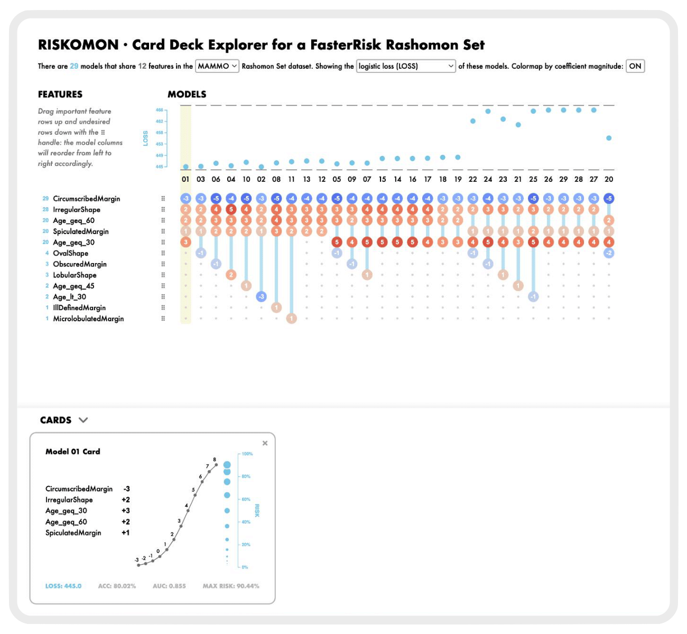
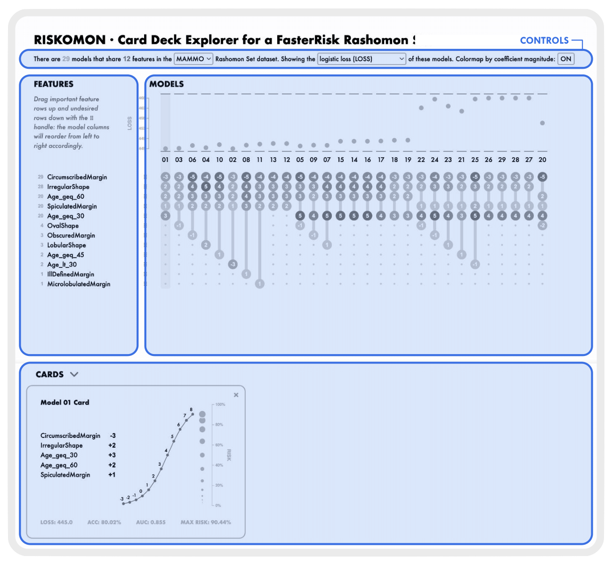
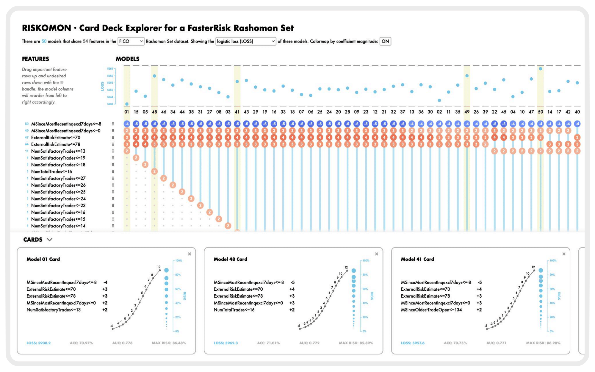

# A Visualization Tool for Risk Score Rashomon Sets

RISKOMON is an interactive visualization tool for the exploration of a Rashomon set of scoring system models—that is, a collection of equally-good risk score models—obtained from the [FasterRisk](https://github.com/interpretml/FasterRisk/tree/main) algorithm. Each column represents a different risk score model. All the models represented have loss close to the best loss possible on the given training set. The yellow stripe indicates a selected model which, just like picking cards from a deck of cards, appears at the bottom of the screen.

This GitHub repo hosts the codebase for a Netlify build, check out the live tool here: [riskomon.netlify.app](https://riskomon.netlify.app/)

## Interface Components

The RISKOMON graphical user interface has four components: the CONTROLS strip, the FEATURES pane, the MODELS pane, and the CARDS pane.

</a>

The CONTROLS strip at the top shows the number of models and features that appear in the Rashomon Set dataset selected in the first dropdown menu. The default Rashomon set shown here, the MAMMO dataset, is a collection of scoring system models that compute breast cancer risk from mammography data. The second dropdown menu lets users pick which statistic to show at the top of the MODELS pane. Logistic loss (LOSS) is the default view. Other possibilities include training accuracy (ACC) and area under the curve (AUC). The full risk profile (RISK) statistic shows the risk percent distribution for each model, not just a single value. The colormap button on the right toggles between the default of coloring by coefficient magnitude and the monochrome alternative. The colormap ranges from red to blue, where red bubbles map to positive coefficients, which add more risk to a model; while blue bubbles map to negative coefficients, which subtract risk from a model.

The FEATURES pane on the left shows all the features that appear in any model in the Rashomon set. For each row, the blue number on the left reports the number of models containing that feature. By default, the feature rows are ordered by the number of different models in which the feature appears. Using the handle to the right of each feature name, a user can drag and drop features to reorder the rows. 

The MODELS pane on the right shows each model as a column. Connected by a vertical line, each bubble in the column represents a feature that appears in the model, and the number in the bubble represents the coefficient of that feature. The order of the model columns depends on the order of the rows; moving features on the left will change the order in which the models appear. The leftmost columns show the models containing the greatest number of features at the top rows of the list of features. Therefore, when you promote feature rows by moving them to the top to indicate their desirability, the columns on the left will represent the models that use those features.

The top of the MODELS pane, above the connected bubbles, contains vertical plots of the model statistic selected in the CONTROLS strip. These plots have a shared axis on the left, with a shared range that is the minimum to maximum values across all models.

The bottom CARDS pane shows the card views of each column selected in the MODELS pane above it; the first one is already selected by default. Selecting more columns makes their cards appear. They can be removed with the X on the upper right or by clicking on the column again. Panning horizontally can show more models.

</a>

Each model’s card view lists all the features that constitute that model, along with the respective score coefficient. The sigmoid risk curve shows how the scores, which are the sum of the coefficients, are translated into risk percentages, encoded as blue circles along the vertical axis. The larger the dot, the higher the risk. The range of the scores reflects all possible coefficient combinations.

The bottom of each card reports four model statistic values: logistic loss (LOSS), training accuracy (ACC), area under the curve (AUC), and overall peak risk (MAX RISK), which is the height of the sigmoid curve.

## Use Case Walkthrough

Now, we briefly walk through an example scenario in which a domain expert decides which model to use for analyzing breast cancer lesions in a mammogram. 

</a>

The expert demotes feature _Age_geq_30_ by dragging it down to the bottom, because most women under 30 don't get mammograms. The model columns reorder accordingly, reflecting the new feature order. The _Age_geq_30_ feature now has a purple downward arrow, showing that it was demoted. 

</a>

Then, the expert promotes the features _SpiculatedMargin_ and _OvalShape_ by dragging them upwards. Again, the model columns reorder, and these promoted features have a green upward arrow by their handles. 

</a>

The current ordering of columns in the MODELS pane shows that only the first three models have both promoted features. The first one, _Model 03_, has both promoted features without the demoted one, but the next two models include that demoted one, so we do not select them. We also notice that from _Model 06_ through _Model 12_, there's one feature we care about without the one we demoted, so we select a few of these within this promising neighborhood to inspect in more detail.

</a>

## Adaptive Design

The current version of RISKOMON comes with five precomputed datasets. Future versions will allow users to upload their own FasterRisk Rashomon Set datasets.

The default dataset, MAMMO, shows cancer risk from mammography information. The BANK dataset shows lending risks. The FICO dataset is a consumer credit score dataset created as an explainable machine learning challenge. The SHROOM dataset models the risk of poisoning from mushroom toxicity. The ADULT dataset shows life insurance risk. Note that the ADULT dataset is the only dataset with opposite valence. In RISKOMON, positive feature coefficients map to high risk, but in the context of ADULT, positive coefficients mean a higher likelihood of life insurance approval.

</a>

The dynamic aspect ratio of RISKOMON adapts the FEATURES, MODELS, and CARDS panes to any screen size, maximizing visual real estate to accommodate larger Rashomon sets, such as the FICO dataset.
