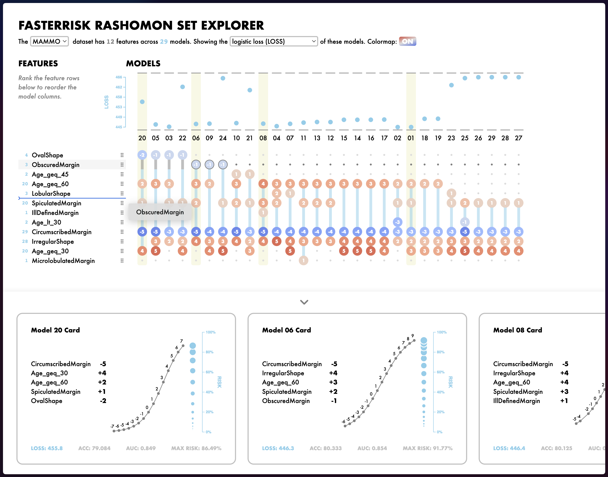

An interactive visualization tool for the exploration of the Rashomon Set of equally-good scoring system models obtained from the [FasterRisk](https://github.com/interpretml/FasterRisk/tree/main) algorithm.

This GitHub repo hosts the codebase for the Netlify build. Check out the live tool here: [fasterriskexplorer.netlify.app](https://fasterriskexplorer.netlify.app/)
