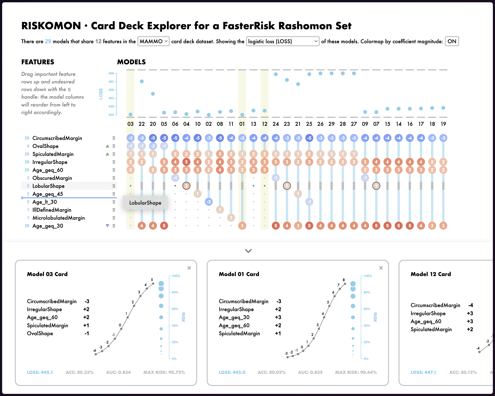

An interactive visualization tool for the exploration of the Rashomon Set of equally-good scoring system models obtained from the [FasterRisk](https://github.com/interpretml/FasterRisk/tree/main) algorithm.

This GitHub repo hosts the codebase for a Netlify build, check out the live tool here: [riskomon.netlify.app](https://riskomon.netlify.app/)
